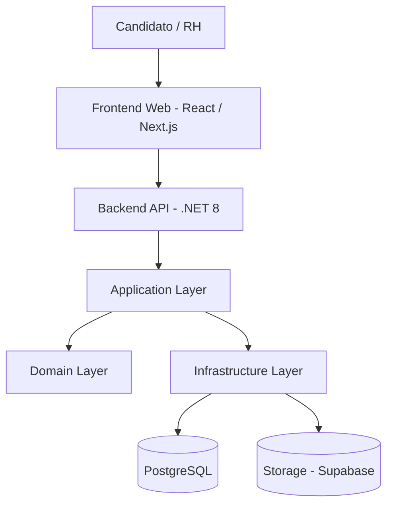
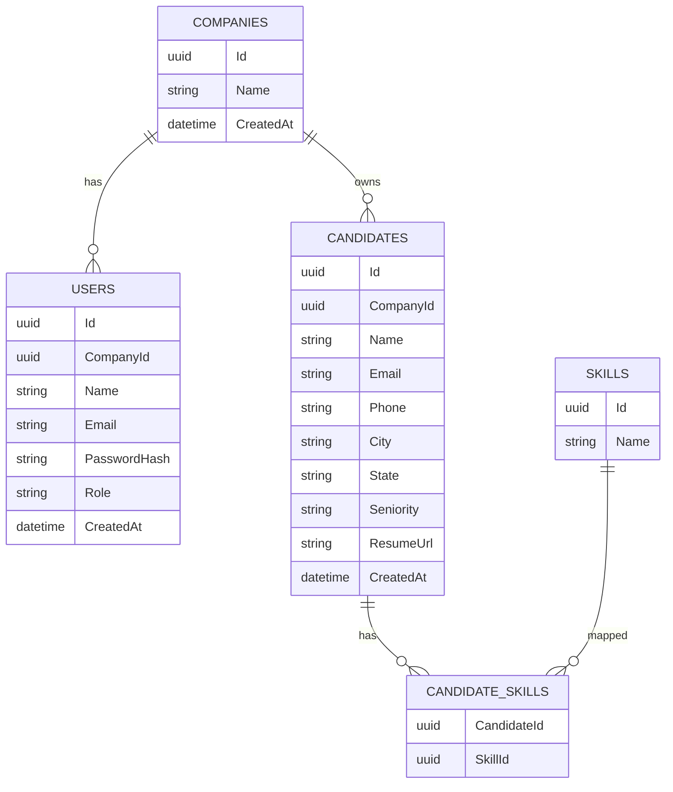
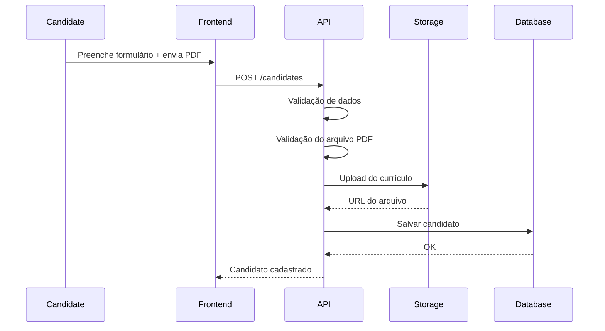
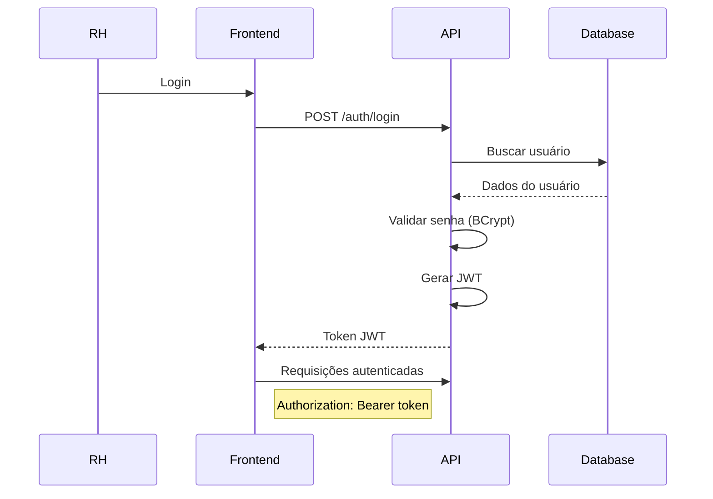
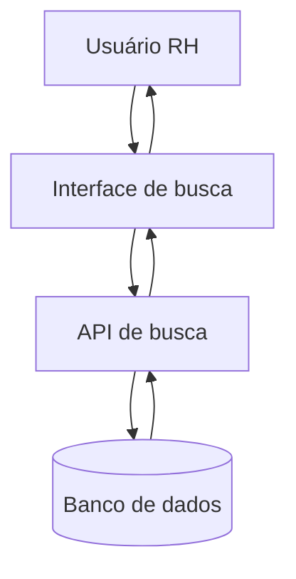
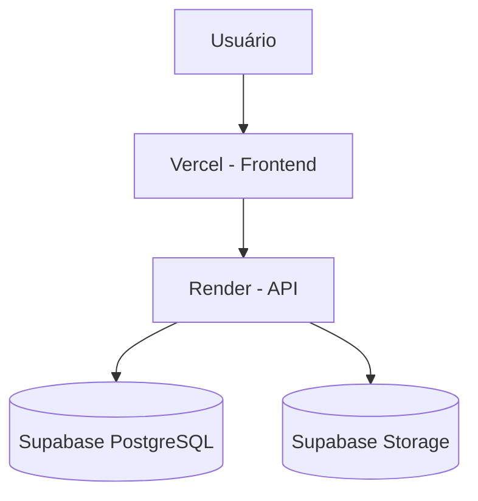

# Plataforma de Banco de Currículos

## Documento Técnico

---

# 1. Visão Geral

Este documento descreve a arquitetura técnica da plataforma de **Banco de Currículos SaaS**, incluindo estrutura do sistema, modelo de dados, fluxos principais e decisões tecnológicas.

O sistema será desenvolvido inicialmente como um **MVP escalável**, utilizando ferramentas gratuitas e arquitetura preparada para crescimento.

Principais objetivos técnicos:

- Simplicidade
- Segurança
- Escalabilidade futura
- Baixo custo inicial

---

# 2. Arquitetura do Sistema

O sistema seguirá uma arquitetura baseada em **Clean Architecture**, com separação clara de responsabilidades.

## Diagrama de Arquitetura



---

# 3. Estrutura do Backend

Estrutura de diretórios recomendada:

```
src/

Api
 Controllers
 Middleware

Application
 Services
 DTOs
 Validators

Domain
 Entities
 Interfaces

Infrastructure
 Repositories
 DbContext
 Storage

Shared
 Exceptions
 Utils
```

---

# 4. Stack Tecnológica

## Backend

- .NET 8 Web API
- Entity Framework Core
- FluentValidation
- JWT Authentication

---

## Frontend

- Next.js

---

## Banco de Dados

PostgreSQL

Opções gratuitas recomendadas:

- Supabase

---

## Armazenamento de Arquivos

Currículos serão armazenados em:

**Supabase Storage**

Formato permitido:

PDF apenas.

---

# 5. Modelo de Dados

## Diagrama ER



---

# 6. Multi-Tenancy

A plataforma será **multiempresa (multi-tenant)**.

Estratégia utilizada:

**Tenant por coluna**

Cada entidade terá:

```
CompanyId
```

Todas as queries devem incluir filtro:

```
WHERE CompanyId = {empresa_logada}
```

Isso garante isolamento lógico de dados.

---

# 7. Fluxo de Cadastro de Candidato



---

# 8. Fluxo de Autenticação



---

# 9. Fluxo de Busca de Candidatos



Filtros disponíveis:

- cidade
- senioridade
- skills

---

# 10. Upload de Currículo

Apenas arquivos **PDF** serão aceitos.

Validações obrigatórias:

- extensão `.pdf`
- MIME type `application/pdf`
- tamanho máximo: **5MB**

Fluxo:

1. candidato envia currículo
2. API valida arquivo
3. arquivo é enviado ao storage
4. URL salva no banco

Exemplo de caminho:

```
resumes/{candidateId}.pdf
```

---

# 11. Segurança

Medidas iniciais implementadas:

### Hash de senha

```
BCrypt
```

---

### Autorização

JWT + Roles

Roles disponíveis:

```
Admin
HR
```

Uso no backend:

```
[Authorize(Roles="HR,Admin")]
```

---

### Rate Limit

Para evitar spam de currículos:

```
AspNetCoreRateLimit
```

---

### Validação de arquivos

Evitar upload malicioso:

- validar MIME
- validar extensão
- limitar tamanho

---

# 12. Índices de Banco

Índices recomendados:

Candidates:

```
index email
index city
index seniority
index companyId
```

CandidateSkills:

```
index candidateId
index skillId
```

---

# 13. Deploy

Arquitetura de deploy:



---

# 14. Roadmap Técnico

## V1 – MVP

- Cadastro de candidatos
- Upload de currículo
- Busca simples
- Multiempresa
- Autenticação

---

## V2 – Melhorias

- Busca por texto no currículo
- Paginação
- Melhor UX

---

## V3 – Inteligência

- IA para análise de currículos
- Ranking automático
- Matching de vagas
- Pipeline de recrutamento